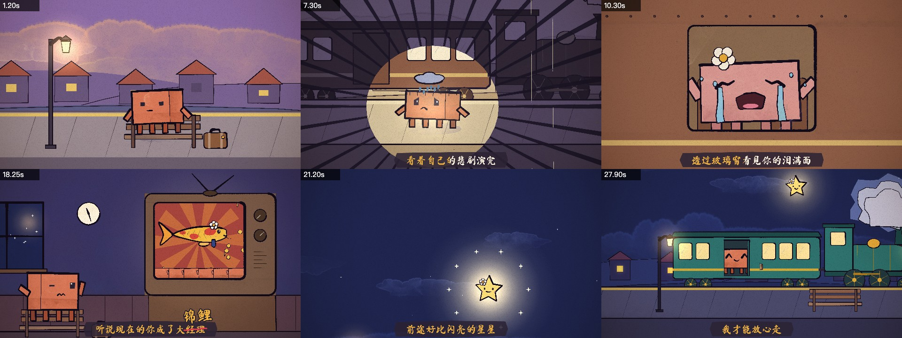
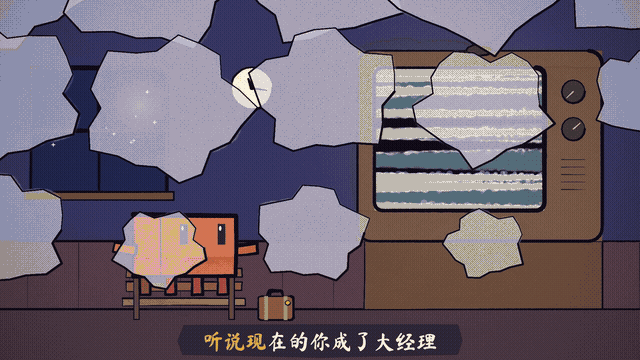

<div align="center">

# painted-animation

<a href="README.md"></a>
<a href="README.zh-CN.md"></a>

A Claude Code skill for making hand-painted cartoons and lyric videos with Claude Opus 5.5.

</div>



Nothing in these frames came out of an image model. Every shot is JavaScript: p5.js with the [p5.brush](https://github.com/acamposuribe/p5.brush) watercolour library, rendered frame by frame in headless Chrome and put together with ffmpeg. Claude writes the storyboard, draws the characters in code, times everything to the song, renders contact sheets, looks at them, and fixes what it doesn't like.

The approach comes from John Heibel's [PDoomVideo](https://github.com/JohnHeibel/PDoomVideo), a 2½-minute music video that Opus 5.5 made more or less on its own, and his follow-up kit [ClaudeAnimationBase](https://github.com/JohnHeibel/ClaudeAnimationBase). I wrapped the two into a skill and added what I needed to make a Chinese lyric video: beat detection, clipping the song, and karaoke subtitles.

## Why do it in code?

An image generator will probably give you a prettier single frame. But a video needs other things, and code handles those well:

- The characters stay the same from shot to shot, because each one is drawn by the same function every time.
- Timing is exact. Every frame is a function of time, so a gag can land on a single sung syllable.
- Fixes are local. When I spotted a layering bug where the character poked out of the train door, it took a few lines of code and a re-render. Nothing else in the video changed.
- Claude can review its own work: it renders stills and frame strips, reads them, and iterates.

Opus 5.5 is good at the whole loop: reading lyrics for their context, writing a storyboard with actual jokes in it, writing a few thousand lines of drawing code that holds together, and critiquing its own renders.

## Example: 小镇姑娘 (David Tao)

<p align="center"></p>

I gave it one verse of lyrics and two notes: take the rest of the song into account, and Chinese fans like to hear "大经理" (big manager) as "大锦鲤" (big lucky koi), so please work that in. Later I added the mp3 and the LRC timings.

It set the whole thing at one small-town station, starting a year ago as she leaves on a train and ending with him getting on one himself. A flower on her head marks her in every form she takes. It measured the song at 154 BPM, 8 beats per line, and cut the action to that. On the word "经理" the TV poofs her into a koi and the subtitle gets crossed out and rewritten as "锦鲤". Then the koi jumps out of the TV and becomes the "shining star" of the next line.

The storyboard and the scene code are in [examples/xiaozhen](examples/xiaozhen/). The song is copyrighted, so it isn't included.

## Install

```bash
git clone https://github.com/tuzhechen2005/painted-animation ~/.claude/skills/painted-animation
```

You'll need Node.js, Google Chrome and ffmpeg. The beat script also needs Python with numpy.

## Use

In Claude Code, just ask for a video:

> Make a 15-second video of Clawd trying to catch a butterfly.

> Make a lyric video for this song. (attach the mp3 and an LRC file)

You can also run `/painted-animation`. It sets up a project, shows you a storyboard, builds and checks each shot, and writes `out/video.mp4`. Short pieces take a few minutes to render on a Mac. Watercolour fills are slow without a GPU.

## What's inside

| Path | |
|---|---|
| `SKILL.md` | The workflow and rules Claude follows |
| `template/` | The engine: the Clawd character, brushes, camera, transitions, karaoke, renderer |
| `scripts/new_project.sh` | Sets up a new project |
| `scripts/beat_grid.py` | Finds a song's tempo and which beat each lyric line falls on |
| `references/music-video.md` | Notes on music videos and longer pieces |
| `examples/xiaozhen/` | The example above |

## Credits

The engine and animation guide are from [ClaudeAnimationBase](https://github.com/JohnHeibel/ClaudeAnimationBase) by John Heibel (MIT, see [template/LICENSE](template/LICENSE)). The method comes from his [PDoomVideo](https://github.com/JohnHeibel/PDoomVideo). Built on p5.js, p5.brush, Puppeteer and ffmpeg. The skill and the example were made with Claude Opus 5.5 in Claude Code.

MIT License.
