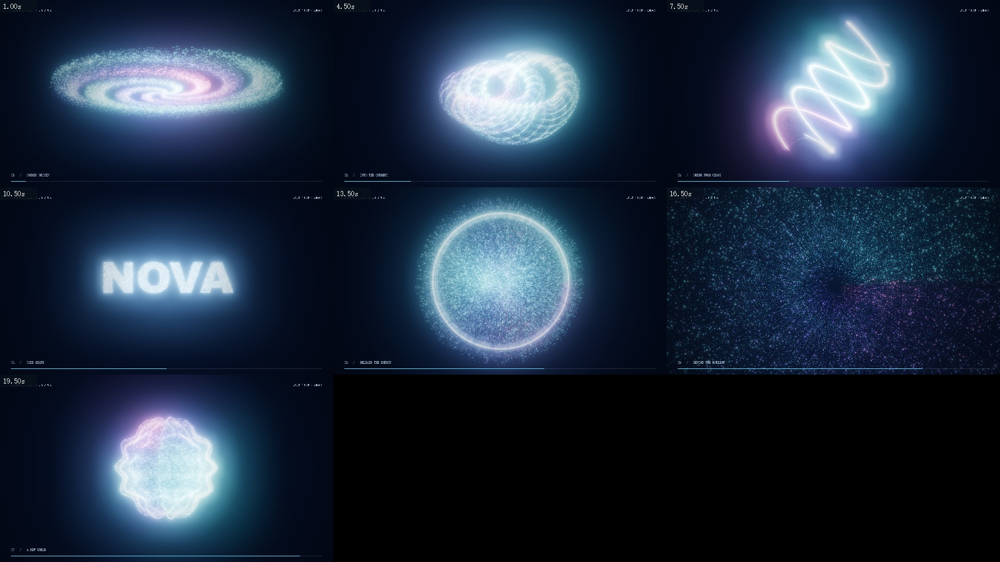

# Particle Cinema · 电影感粒子动画

[English](README.md)

用 Three.js / GLSL 制作粒子星系、编织流场、双螺旋、文字与 Logo 聚合、能量爆散、星际穿梭和能量球。
包含可播放、暂停和拖动时间轴的本地预览，以及 21 秒完整示例。画面加入辉光、解析拖尾、连续变形和镜头运动，可导出 MP4。



Claude Code 安装：

```text
/plugin marketplace add goforai-vip/opus-video-skills
/plugin install particle-cinema@opus-video-skills
```

Codex 安装：将本目录 `particle-cinema` 复制到个人 `~/.codex/skills` 目录。
例如这样描述：『做一段电影感粒子动画：星系收束成我的 Logo，再爆散成光，穿过星际隧道。』

也可以直接运行模板：

```bash
node skills/particle-cinema/scripts/new_project.mjs my-particles
cd my-particles
npm ci
npm run preview
npm run sheet
npm run clip
```

需要 Node.js 20.19+ 或 22.12+、Chrome/Chromium 和 ffmpeg，无需 API Key、生图服务或 CDN。
默认成片为 1920×1080、30 fps、无声。草稿、标准、超高三档分别为 1.6 万、6 万、14 万粒子，拖尾会增加绘制量，速度取决于显卡。
文字采用配置的本机字体，Logo 支持本地透明 PNG 或自包含 SVG。

这个版本的流场采用解析编织轨迹；尚未实现流体模拟、自动音频频谱驱动或无缝循环。
带配音的产品片会先合成解说，再按实际声音时长设计粒子与转场。附带逐句配音、字幕时间轴和音乐压低混音脚本，
默认中文声线为云希（语速 +12%、音调 -2Hz），可按要求修改。[配音流程](references/narration.md)。
修改方法、画面审查和导出命令见 [SKILL.md](SKILL.md)。

遵循仓库 [MIT 协议](../../LICENSE)。
